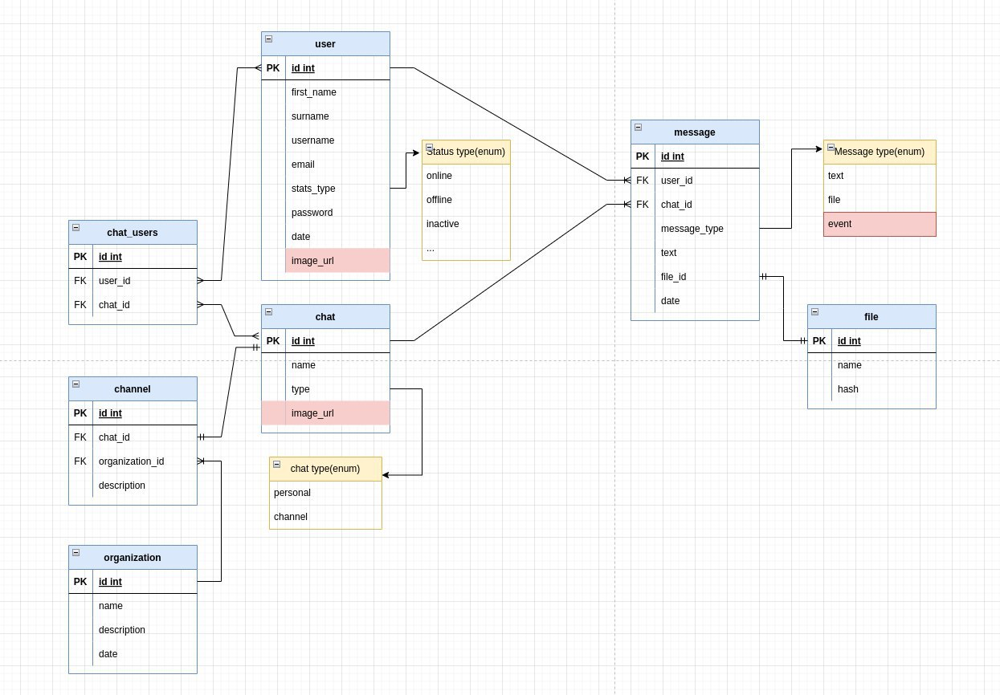

# AvoChad Backend
This backend was implemented for the AvoChad project. It is a REST API that allows users to create and manage their own __avocados chats__.
This backend is built using the [Spring Boot](https://spring.io/projects/spring-boot) framework.

# API Documentation

## Authentication Controller
The API uses [JWT](https://jwt.io/) for authentication. The JWT is sent in the `Authorization` header of each request. The JWT is valid for 1 hour.

### Endpoints

#### Login
`POST /login`
As input to login We'll get AuthenticationDTO object with username / email and password. If the username and password are correct, the API will return a JWT token.
Otherwise, it will catch a custom exception and return a `401` **Unauthorized Error Response**.

#### Register
`POST /register`
As input to register We'll get UserDTO object with firstName, secondName, username, email and password. If the username and email are not already taken, the API will return a JWT token.

## User Controller
This controller is used to manage the users.

### Endpoints
`GET /`
This endpoint is used to get all users. It is only accessible by the admin.\
\
`GET /id`
This endpoint is used to get a user by id. It is only accessible by the admin.\
\
`Delete /id` This endpoint is used to delete a user by id. It is only accessible by the admin.  
\
`PUT /id` This endpoint is used to update a user by id. It is only accessible by the admin. 

## Chat Controller
This controller is used to manage the chats.

### Endpoints
`GET /`
This endpoint is used to get all chats.\
\
`GET /id`
This endpoint is used to get a chat by id. \
\
`GET /user/{id}` This endpoint is used to get all chats by user id. \
\
`Delete /id` This endpoint is used to delete a chat by id. \
\
`PUT /id` This endpoint is used to update a chat by id. \
\
`POST /` This endpoint is used to create a chat. \

# Frameworks and Libraries
- [Spring Boot](https://spring.io/projects/spring-boot)
- [Spring Data JPA](https://spring.io/projects/spring-data-jpa)
- [Spring Security](https://spring.io/projects/spring-security)
- [Spring Web](https://spring.io/projects/spring-framework)
- [Hibernate Validator](https://hibernate.org/validator/)
- [Hibernate](https://hibernate.org/)
- [Maven](https://maven.apache.org/)
- [JUnit](https://junit.org/junit5/)

## Database
- [PostgreSQL](https://www.postgresql.org/)

### Database Schema

